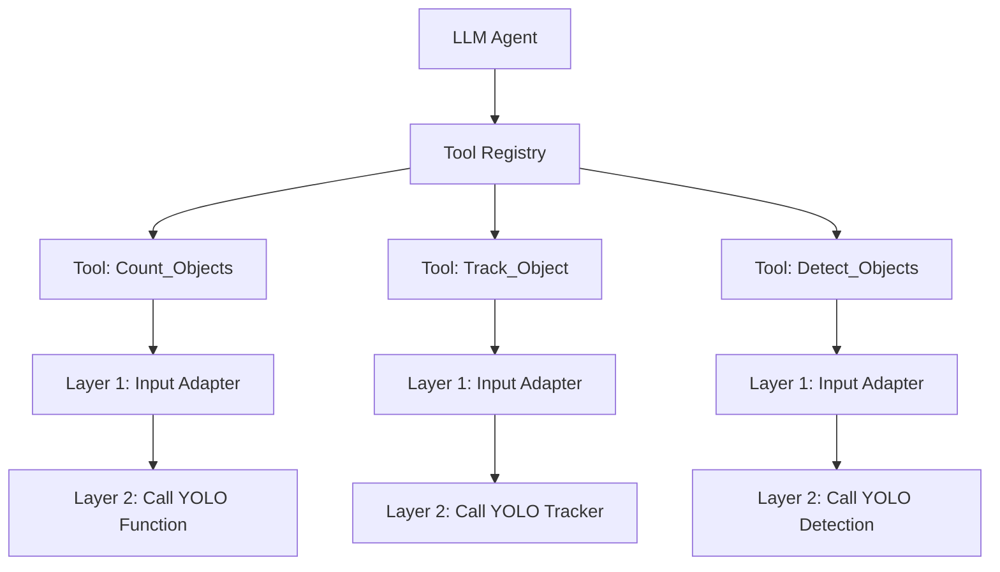
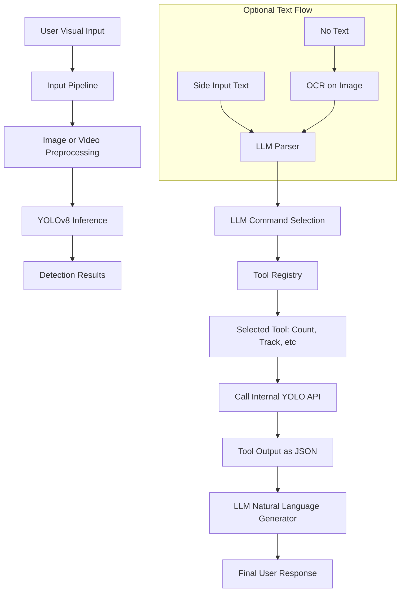
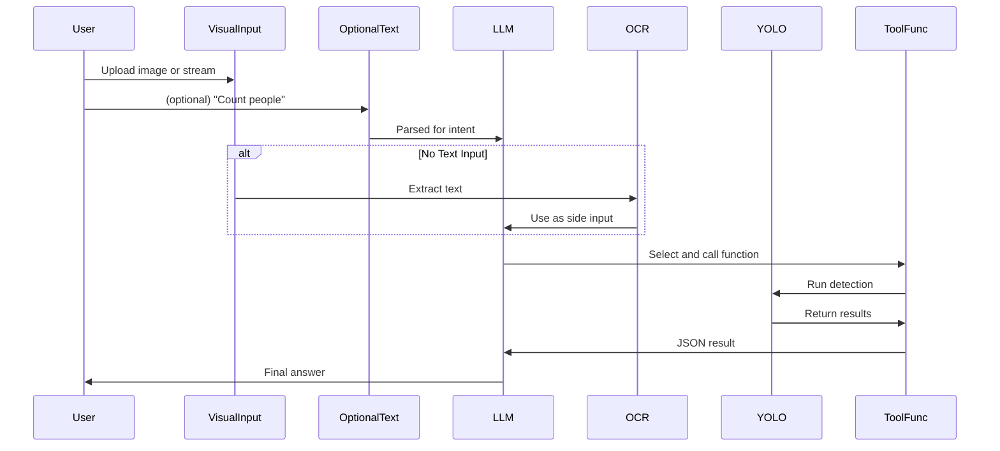

# ai-sight

### Tool Registry

```mermaid
graph TD
  A[LLM Agent] --> B[Tool Registry]

  B --> C[Tool: Count_Objects]
  B --> D[Tool: Track_Object]
  B --> E[Tool: Detect_Objects]

  C --> C1[Layer 1: Input Adapter]
  C1 --> C2[Layer 2: Call YOLO Function]

  D --> D1[Layer 1: Input Adapter]
  D1 --> D2[Layer 2: Call YOLO Tracker]

  E --> E1[Layer 1: Input Adapter]
  E1 --> E2[Layer 2: Call YOLO Detection]

```
### Visual + Text Data Flow

```mermaid
flowchart TD
  A[User Visual Input] --> B[Input Pipeline]
  B --> C[Image or Video Preprocessing]
  C --> D[YOLOv8 Inference]

  subgraph Optional Text Flow
    E[Side Input Text] --> F[LLM Parser]
    G[No Text] --> H[OCR on Image]
    H --> F
  end

  D --> I[Detection Results]
  F --> J[LLM Command Selection]

  J --> K[Tool Registry]
  K --> L[Selected Tool: Count, Track, etc]
  L --> M[Call Internal YOLO API]
  M --> N[Tool Output as JSON]

  N --> O[LLM Natural Language Generator]
  O --> P[Final User Response]

```

### Logic Sequence

```mermaid
sequenceDiagram
  participant User
  participant VisualInput
  participant OptionalText
  participant LLM
  participant OCR
  participant YOLO
  participant ToolFunc

  User ->> VisualInput: Upload image or stream
  User ->> OptionalText: (optional) "Count people"
  OptionalText ->> LLM: Parsed for intent
  alt No Text Input
    VisualInput ->> OCR: Extract text
    OCR ->> LLM: Use as side input
  end
  LLM ->> ToolFunc: Select and call function
  ToolFunc ->> YOLO: Run detection
  YOLO ->> ToolFunc: Return results
  ToolFunc ->> LLM: JSON result
  LLM ->> User: Final answer

```
